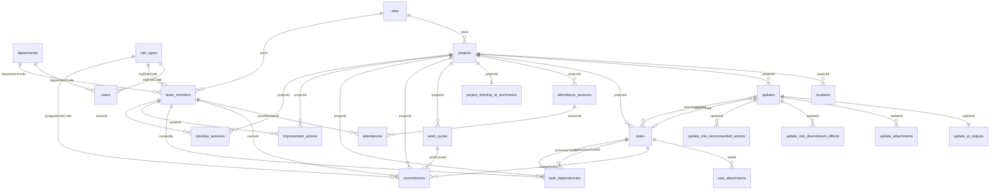
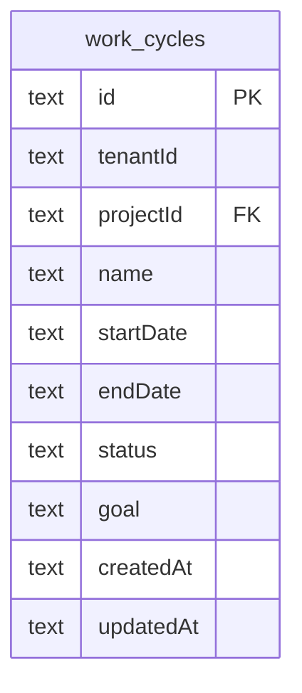
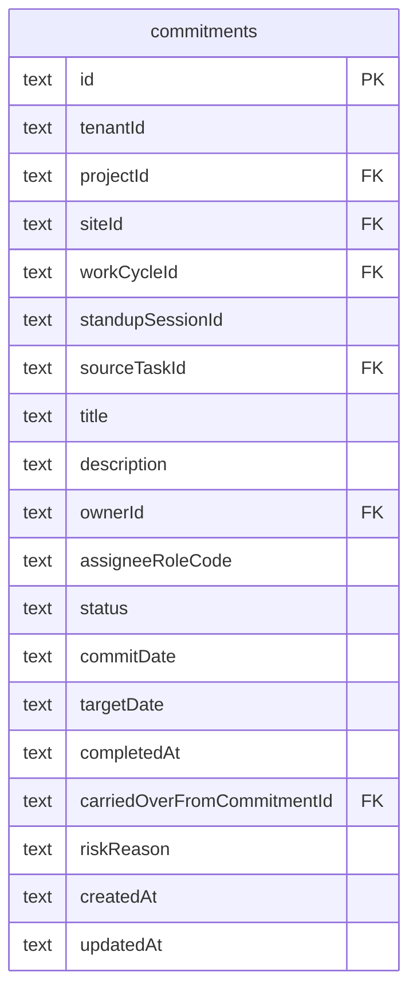
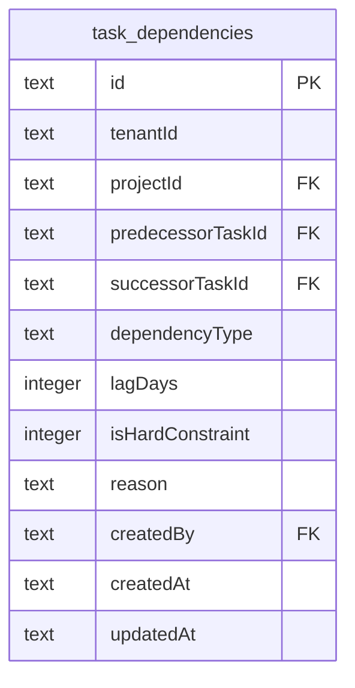
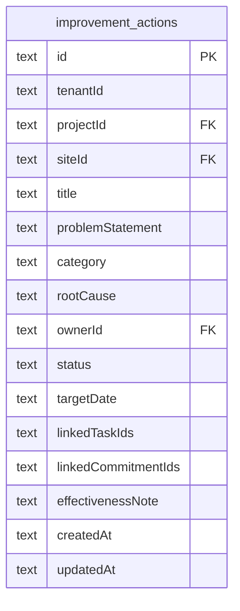
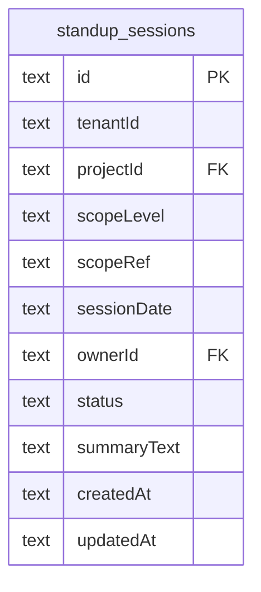
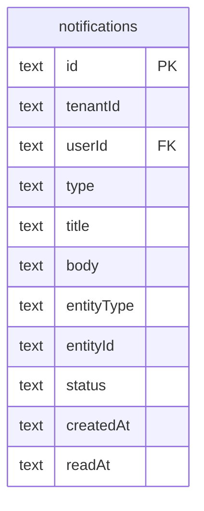

# Entity-relationship diagram (SQLite persistence)

**Source of truth for tables and columns:** `packages/database/src/schema.ts` (Drizzle). **Wire shapes:** `packages/contracts`. **Zod enum literals** per table: see each entity’s **Enums** section in this folder (shared catalog: [`enums.ts`](../../packages/contracts/src/enums.ts)).

This page holds the **Mermaid `erDiagram`** for the persisted model. For a **flowchart-style** overview (masters vs capture vs roll call), see [index.md](./index.md). For **updates ↔ tasks** semantics (`sourceUpdateId`, `linkedTaskId`), see [update.md](./update.md). For **API JSON field names** and integrity rules, see [canonical-org-location-and-integrity.md](./canonical-org-location-and-integrity.md).

## ER diagram

## Notes

- **`updates` ↔ `tasks`:** The link is two optional FK-style columns, not a join table: `tasks.sourceUpdateId` (voice/AI spawned a task from a note) and `updates.linkedTaskId` (human follow-up on an existing task). See [update.md](./update.md).

- **Standup prep lists** (planned / completed / blocked) are **not** separate tables: the API derives read-model items from `tasks` (see [standup-prep-from-tasks.md](../field-app/standup-prep-from-tasks.md)). `project_standup_ai_summaries` stores optional AI summary snapshots per project/date.

- **Demo bundles** align with these tables; CSV column join keys and the validator are documented under [data-contract-validator-crosscheck.md](../demo/data-contract-validator-crosscheck.md).

---

## Phase A Entities (Read Models)

Phase A introduced contracts for the following entities with read-model APIs.

| Entity | Contract | Read API | Persistence |
| ------ | -------- | -------- | ----------- |
| **Commitment** | `CommitmentSchema`, `CommitmentCardSchema` | `GET /v1/commitments/horizon?projectId=...` (and flat `/v1/commitments` CRUD) | `commitments` table (Phase B) |
| **Dependency** | `DependencySchema`, `DependencyCardSchema`, `DependencySummarySchema` | `/v1/dependencies` (create/get/patch/delete/override) | `task_dependencies` table (Phase B) |
| **Improvement** | `ImprovementSchema`, `ImprovementCardSchema` | `/v1/improvements` | `improvement_actions` table (Phase C) |
| **Cycle** | `CycleSchema`, `CycleCardSchema` | `GET /v1/cycles?projectId=...` | `work_cycles` table (Phase B) |

---

## Phase B Entities (Persisted)

Phase B added persistence with SQLite tables and full write APIs.

### work_cycles

Weekly/bi-weekly planning horizons.

**Status values:** `planned`, `active`, `closed`

**Constraints:**

- `endDate >= startDate`
- No overlapping active cycles per project

### commitments

Task delivery commitments with reliability tracking.

**Status values:** `planned`, `in_progress`, `completed`, `at_risk`, `missed`, `carried_over`

**Invariants:**

- `targetDate >= commitDate`
- If `sourceTaskId` is set, `projectId` must match
- `carried_over` requires prior commitment or task linkage

### task_dependencies

Explicit sequencing and constraint management.

**Dependency types:** `finish_to_start`, `blocks`, `start_to_start`, `finish_to_finish`

**Invariants:**

- `predecessorTaskId !== successorTaskId` (no self-edges)
- Both tasks must exist and share `projectId`
- No duplicate active edge of same pair/type
- Reject hard-constraint cycles

**Execution behavior:**

- Blocked successor cannot move to `in_progress` unless explicit override
- All overrides emit audit events

---

## Phase C Entities (Improvement Actions)

### improvement_actions

Structured countermeasures for repeated or systemic issues.

**Category values:** `quality`, `schedule`, `safety`, `maintenance`, `process`, `other`
**Status values:** `open`, `in_progress`, `validated`, `closed`

---

## Phase D Entities (Standup Sessions & Notifications)

### standup_sessions

Persistent standup workflow objects.

**Scope levels:** `team`, `department`, `site`, `plant`, `region`
**Status values:** `draft`, `active`, `closed`

### notifications

User notification records.

**Status values:** `unread`, `read`, `archived`

---

See [index.md](./index.md) for contract file locations, [Phase A plan](./plans/phase-A-contracts-and-read-models.md), and [Phase B plan](./plans/phase-B-persisted-commitments-and-dependencies.md) for full scope.

Parent: [AGENTS.md](./AGENTS.md).
