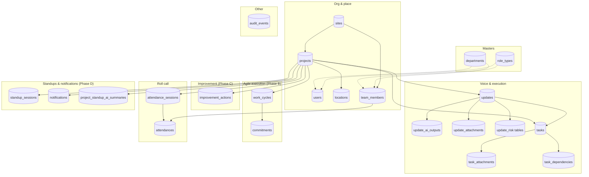

# Data model index

**Source of truth for persistence:** `packages/database/src/schema.ts` (Drizzle + SQLite). **Wire/API shapes:** `packages/contracts/src/*.ts`.

This folder lists each persisted entity (or group of tightly coupled tables) with a short dedicated page. Each entity doc includes a **Fields** section with the complete SQLite column specification. For **updates ↔ tasks** edges and review semantics, see [`update.md`](./update.md) (**Updates ↔ tasks (canonical)**). For **org roles, departments, locations, and public JSON field names**, see [`./canonical-org-location-and-integrity.md`](./canonical-org-location-and-integrity.md).

**Enums:** There is no separate `enums.md`. Shared Zod enums live in [`packages/contracts/src/enums.ts`](../../packages/contracts/src/enums.ts). Each entity page documents the **enums that apply to that table** under an **Enums** heading. API-only enums (e.g. list `noteState`) live in [`packages/contracts/src/api-responses.ts`](../../packages/contracts/src/api-responses.ts) and are summarized on [`invariants/updates-tasks-workflow-invariants.md`](invariants/updates-tasks-workflow-invariants.md) where they affect workflow.

---

## Tabular overview

| Entity / topic | SQLite table(s) | Doc | Contracts (primary) |
| ---------------- | ----------------- | --- | --------------------- |
| Department | `departments` | [department.md](./department.md) | `enums.ts` (`DepartmentEnum`) |
| Role | `role_types` | [role.md](./role.md) | `enums.ts` (`RoleTypeCodeSchema`, …) |
| User | `users` | [user.md](./user.md) | `user.ts` |
| Site | `sites` | [site.md](./site.md) | `site.ts` |
| Project | `projects` | [project.md](./project.md) | `project.ts` |
| Location | `locations` | [location.md](./location.md) | `location.ts` |
| Member | `team_members` | [member.md](./member.md) | `member.ts` |
| Update (incl. AI output, attachments, risk rows) | `updates`, `update_ai_outputs`, `update_attachments`, `update_risk_downstream_effects`, `update_risk_recommended_actions` | [update.md](./update.md) | `update.ts`, `media.ts` |
| Task (incl. attachments) | `tasks`, `task_attachments` | [task.md](./task.md) | `task.ts`, `media.ts` |
| Attendance | `attendance_sessions`, `attendances` | [attendance.md](./attendance.md) | `attendance.ts` |
| Standup AI summary | `project_standup_ai_summaries` | [standup-ai-summary.md](./standup-ai-summary.md) | (snapshot fields in API responses; see `standup.ts` / API routes) |
| Audit | `audit_events` | [audit.md](./audit.md) | (payload-oriented; not always a full Zod entity) |
| Cycle | `work_cycles` | [cycle.md](./cycle.md) | `cycle.ts` |
| Commitment | `commitments` | [commitment.md](./commitment.md) | `commitment.ts` |
| Dependency | `task_dependencies` | [dependency.md](./dependency.md) | `dependency.ts` |
| Improvement | `improvement_actions` | [improvement.md](./improvement.md) | `improvement.ts` |
| Standup session | `standup_sessions` | [standup-session.md](./standup-session.md) | `standup.ts` |
| Notification | `notifications` | [notification.md](./notification.md) | `notification.ts` |
| Notification preference | `notification_preferences` | [notification-preferences.md](./notification-preferences.md) | (per-channel prefs; see schema + `users`) |
| Delivery attempt | `delivery_attempts` | [delivery-attempt.md](./delivery-attempt.md) | (audit of notification delivery) |
| Outbox event | `outbox_events` | [outbox-event.md](./outbox-event.md) | (enqueue from `insertAuditEvent`; no separate contract file) |
| File | `files` | [file.md](./file.md) | `file.ts` |

**Read models (not separate SQLite tables for standup prep lists):** `StandupPrepResponseSchema` and related item schemas in `packages/contracts/src/standup.ts` — assembled from `tasks` at API read time. See [update.md](./update.md) and [`../field-app/standup-prep-from-tasks.md`](../field-app/standup-prep-from-tasks.md).

---

## Phase A Contracts (Read Models)

The following contracts were added in Phase A to support Agile Execution read-model APIs.

| Contract | Schemas | API Endpoint | Status |
| -------- | ------- | ------------ | ------ |
| Commitment | `CommitmentSchema`, `CommitmentCardSchema`, `CommitmentStatusEnum`, `CommitmentHorizonEnum` | `GET /v1/commitments?projectId=...` | **Persisted (Phase B)** |
| Dependency | `DependencySchema`, `DependencyCardSchema`, `DependencySummarySchema`, `DependencyTypeEnum` | `GET /v1/dependencies?projectId=...` | **Persisted (Phase B)** |
| Improvement | `ImprovementSchema`, `ImprovementCardSchema`, `ImprovementCategoryEnum`, `ImprovementStatusEnum` | (Phase C) | Contract defined |
| Cycle | `CycleSchema`, `CycleCardSchema`, `CycleStatusEnum` | `GET /v1/cycles?projectId=...` | **Persisted (Phase B)** |

**Contract files:**

- [`packages/contracts/src/commitment.ts`](../../packages/contracts/src/commitment.ts)
- [`packages/contracts/src/dependency.ts`](../../packages/contracts/src/dependency.ts)
- [`packages/contracts/src/improvement.ts`](../../packages/contracts/src/improvement.ts)
- [`packages/contracts/src/cycle.ts`](../../packages/contracts/src/cycle.ts)

**Reference:** See [Phase A plan](./plans/phase-A-contracts-and-read-models.md), [Phase B plan](./plans/phase-B-persisted-commitments-and-dependencies.md), and [NEW-DATA-MODELS-AND-ROUTES-REFERENCE.md](./plans/NEW-DATA-MODELS-AND-ROUTES-REFERENCE.md) for full canonical model.

---

## Phase B Persisted Entities

Phase B adds persistence for Agile Execution entities with full write APIs.

| Entity | SQLite Table | API Endpoints | Status |
| ------ | ------------ | ------------- | ------ |
| **WorkCycle** | `work_cycles` | `POST /v1/cycles`, `GET/PATCH /v1/cycles/:workCycleId` | Persisted |
| **Commitment** | `commitments` | `POST /v1/commitments`, `GET/PATCH /v1/commitments/:commitmentId` | Persisted |
| **TaskDependency** | `task_dependencies` | `POST /v1/dependencies`, `GET/PATCH /v1/dependencies/:dependencyId`, `DELETE /v1/dependencies/:dependencyId` | Persisted |

**Invariants enforced:**

- Project-scope integrity: all cross-entity references must share `projectId`
- No self-edge dependencies (`predecessorTaskId !== successorTaskId`)
- Cycle prevention for hard constraints
- State transition validation for commitments

**Error codes:**

- `PROJECT_SCOPE_MISMATCH`: cross-project reference rejected
- `DEPENDENCY_CYCLE_DETECTED`: adding edge would create cycle
- `DEPENDENCY_INVALID_EDGE`: self-edge or duplicate edge
- `COMMITMENT_INVALID_STATE_TRANSITION`: invalid status change

**Reference:** See [Phase B plan](./plans/phase-B-persisted-commitments-and-dependencies.md).

---

## Phase C Entities (Technical Review & Improvement)

Phase C adds improvement actions and technical review workflows.

| Entity | SQLite Table | API Endpoints | Status |
| ------ | ------------ | ------------- | ------ |
| **ImprovementAction** | `improvement_actions` | `POST /v1/improvements`, `GET/PATCH /v1/improvements/:improvementActionId` | Persisted |

**Technical Review Routes:**
- `GET /v1/reviews?projectId=...` - Technical review queue
- `POST /v1/tasks/:taskId/review/submit` - Submit task for review (body: `{ projectId, submittedBy }`)
- `POST /v1/tasks/:taskId/review/approve` - Approve reviewed task (body: `{ projectId, approvedBy }`)
- `POST /v1/tasks/:taskId/review/request-rework` - Request rework (body: `{ projectId, requestedBy, reason }`)

**Analytics Routes:**
- `GET /v1/metrics/reliability?projectId=...` - Reliability dashboard
- `GET /v1/metrics/pilot?projectId=...` - Comprehensive KPIs

**Reference:** See [Phase C plan](./plans/phase-C-technical-review-improvement-loop.md).

---

## Phase D Entities (Standups & Notifications)

Phase D adds persistent standup sessions and notification infrastructure.

| **StandupSession** | `standup_sessions` | `POST /v1/standups`, `GET/PATCH /v1/standups/:standupId` | Persisted |
| **StandupAttendanceRecord** | (via attendance_sessions/attendances) | `GET/POST /v1/standups/:standupId/attendance` | Persisted |
| **ProjectStandupAISummary** | `project_standup_ai_summaries` | (no public HTTP surface; demo/legacy table) | Optional |
| **Notification** | `notifications` | `GET/PATCH /v1/notifications/:notificationId` | Persisted |

**Standup Commands:**
- `POST /v1/ai/standup-summary` - Generate AI summary on demand (body: `{ projectId }`)
- `POST /v1/standups/:standupId/open` - Open standup session (body: `{ projectId }`)
- `POST /v1/standups/:standupId/close` - Close standup session (body: `{ projectId }`)

**Reference:** See [Phase D plan](./plans/phase-D-standup-sessions-notifications.md).

---

## Phase F - Flat Updates and Tasks (Route Restructure)

Phase F introduces **flat routes** for updates and tasks, enabling cross-project queries and direct entity access without requiring project-scoped URLs.

### Flat Update Routes (§12.8)

| Method | Path | Description |
|--------|------|-------------|
| `GET` | `/v1/updates` | List updates with filters (projectId, siteId, status, from, to) |
| `GET` | `/v1/updates/:updateId` | Get single update |
| `PATCH` | `/v1/updates/:updateId` | Update update fields |

### Update Commands (§12.11)

Slash-style commands (implementation uses `/` not `:` for compatibility):

| Method | Path | Description |
|--------|------|-------------|
| `POST` | `/v1/updates/:updateId/transcribe` | Transcribe audio (body: `{ projectId }`) |
| `POST` | `/v1/ai/voice-note-extraction` | AI extraction (body: `{ updateId, projectId }`) |
| `POST` | `/v1/updates/:updateId/confirm-review` | Confirm review (body: `{ projectId }`) |
| `POST` | `/v1/updates/:updateId/escalate` | Escalate update (body: `{ projectId, reason }`) |

### Flat Task Routes (§12.12)

| Method | Path | Description |
|--------|------|-------------|
| `GET` | `/v1/tasks` | List tasks with filters |
| `GET` | `/v1/tasks/:taskId` | Get single task |
| `PATCH` | `/v1/tasks/:taskId` | Update task status |
| `POST` | `/v1/tasks` | Create task (projectId in body) |

**Note:** Tasks are **flat** under `/v1/tasks` with `projectId` in query (list) or body (create). There is no `/v1/projects/:projectId/tasks/...` router.

**Source files:**
- `apps/api/src/routes/update-actions.ts` - Update routes
- `apps/api/src/routes/tasks-flat.ts` - Flat task routes
- `docs/api/routes/updates.md`, `docs/api/routes/tasks.md` — flat routes and commands

**Reference:** See [Phase F plan](./plans/phase-F-flat-updates-and-tasks.md).

---

## Phase H - Audit Read API and Route Integrity

Phase H closes read-model gaps with audit trail endpoints and eliminates duplicate route implementations.

### Audit Events (§12.23)

| Method | Path | Description |
|--------|------|-------------|
| `GET` | `/v1/audit` | List audit events with filters |
| `GET` | `/v1/audit/:auditEventId` | Get single audit event |

**Filter parameters:** entityType, entityId, projectId, siteId, actor, eventType, from, to

### Route Integrity Improvements

- **Consolidated duplicate routes:** `pilot-metrics` and `execution-reliability` only in phase-c.ts
- **Real dependency summaries:** Technical review queue (`GET /v1/reviews`) uses `computeDependencySummaries()` helper
- **Removed stub helpers:** `getStubDependencySummary` replaced with real computation

**Source files:**
- `apps/api/src/routes/audit.ts` - Audit routes
- `apps/api/src/lib/dependencies.ts` - Dependency computation

**Reference:** See [Phase H plan](./plans/phase-H-audit-read-and-route-integrity.md) and [audit.md](./audit.md).

---

## Information hierarchy (ASCII)

```
Masters
  departments ─────┐
  role_types ────────┼──► users
                     │
 sites ───────────────┼──► projects ────► locations
        │             │         │
        │             │         ├──► updates ──┬──► update_ai_outputs
        │             │         │              ├──► update_attachments
        │             │         │              └──► update_risk_* (2 tables)
        │             │         │
        │             │         ├──► tasks ────────► task_attachments
        │             │         │       ▲    │
        │             │         │       │    └──► task_dependencies
        │             │         │       │ sourceUpdateId / linkedTaskId
        │             │         └───────┴──────────── (see update.md — Updates ↔ tasks)
        │             │
        │             ├──► team_members ──► attendances ◄── attendance_sessions
        │             │
        │             ├──► work_cycles ──► commitments
        │             │
        │             ├──► improvement_actions (Phase C)
        │             │
        │             ├──► standup_sessions (Phase D)
        │             │
        │             └──► notifications (Phase D)
        │
        └── (optional) project_standup_ai_summaries (per project snapshot)

audit_events ................. cross-cutting (entityType + entityId + JSON payload)
```

---

## Entity-relationship overview (Mermaid)



---

## Related documentation

| Doc | Role |
| --- | ---- |
| [`./entity-relationship-diagram.md`](./entity-relationship-diagram.md) | Mermaid `erDiagram` (same tables as above; single place for the ER view) |
| [`./update.md`](./update.md) | Two edges between updates and tasks; standup read model; child table semantics (**Updates ↔ tasks (canonical)**) |
| [`./canonical-org-location-and-integrity.md`](./canonical-org-location-and-integrity.md) | FK columns and API JSON naming |
| [`../../packages/database/src/schema.ts`](../../packages/database/src/schema.ts) | Drizzle definitions |
| [`../demo/data-contract-validator-crosscheck.md`](../demo/data-contract-validator-crosscheck.md) | Demo CSV join keys and `validate_demo_datasets.mjs` |
