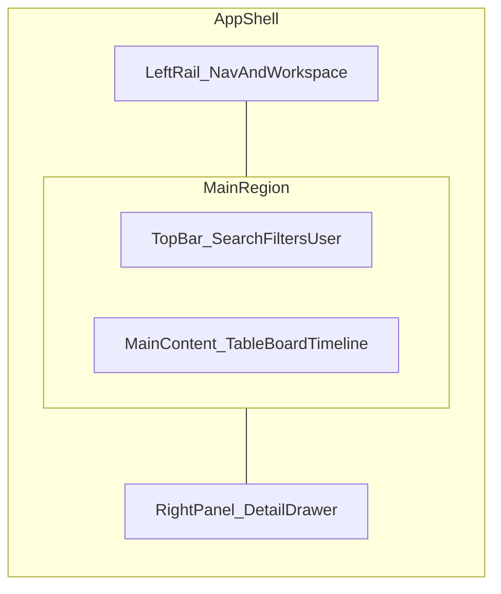

# Planning console — plan overview

High-level delivery view for `apps/planning-web`. **Contracts and entities** are defined once in `@v2e/contracts` and documented in [`AGILE-EXECUTION-DATA-MODEL.md`](../../strategy/AGILE-EXECUTION-DATA-MODEL.md); this doc only names **what we ship** and **where it lives in the shell**.

## Design philosophy

- **Less is more:** minimal chrome, generous whitespace, thin borders — suitable for long sessions in **browser** or **desktop** window.
- **Density with restraint:** multi-item planning needs information density; avoid decorative noise and redundant panels.
- **Same data model as field execution:** planning console reads/writes the same operational objects; surface independence is **UI and app packaging only** (see [ADR 0003](../../architecture/adr/0003-independent-enact-ui-surfaces-no-cross-app-react.md)).
- **Planning uses `rounded-lg` for cards** (vs field-app's `rounded-3xl`) to signal a tighter, more "operational" aesthetic.

## Shell layout (conceptual)

Persistent **three-region** shell: primary navigation and workspace context on the left, main working area in the center (with a **top band** for global affordances), optional **detail** region on the right.



## ASCII shell layout (all phases)

```
┌─────────────────────────────────────────────────────────────────────────────────────┐
│  LEFT RAIL (256px)     │              TOP BAR (56px)                    │ RIGHT PANEL │
│                         │                                                  │  (384px,    │
│  ┌───────────────────┐  │  ┌──────────────────┐ ┌──────┐ ┌──────┐ ┌────┐ │  collapsible│
│  │  V2E Planning    │  │  │ 🔍 Search...     │ │Saved │ │Filter│ │User│ │             │
│  │  ───────────────  │  │  └──────────────────┘ └──────┘ └──────┘ └────┘ │             │
│  │  ◀ Review Queue  │  │                                                  │             │
│  │    Tasks         │  │  [Page Title]                      [actions]    │             │
│  │    Commitments   │  │  ─────────────────────────────────────────────│             │
│  │    Tech Review   │  │                                                  │             │
│  │    Blockers      │  │  ┌──────────────────────────────────────────────┐│             │
│  │    Standup        │  │  │                                              ││             │
│  │    Schedule       │  │  │         MAIN CONTENT                        ││             │
│  │  ──────────────  │  │  │         (scrollable outlet)                  ││             │
│  │    Reports       │  │  │                                              ││             │
│  │    Admin         │  │  │                                              ││             │
│  └───────────────────┘  │  └──────────────────────────────────────────────┘│             │
│                          │                                                  │             │
│  [workspace context]    │                                                  │             │
└──────────────────────────┴─────────────────────────────────────────────────┴─────────────┘
```

### Left Rail anatomy

```
┌─────────────────────────┐
│  V2E Planning           │  ← Logo
│  ─────────────────────   │  ← Hairline divider
│  ◀ Review Queue         │  ← Active nav item (left 3px brand border + bg tint)
│    Tasks                │  ← Inactive nav item (ghost button style)
│    Commitments          │
│    Tech Review          │
│    Blockers             │
│    Standup              │
│    Schedule             │
│  ─────────────────────   │  ← Section divider
│    Reports              │
│    Admin                │
│  ─────────────────────   │
│  [Project / Site ctx]   │  ← Workspace context footer
└─────────────────────────┘
```

### Top Bar anatomy

```
┌─────────────────────────────────────────────────────────────────────────┐
│ ┌──────────────────────────────┐  ┌────────┐  ┌────────┐  ┌────────┐ │
│ │ 🔍 Search or jump to...      │  │ Saved  │  │ Filter │  │ User   │ │
│ └──────────────────────────────┘  │ Views  │  │ Panel  │  │ Menu   │ │
│                                     └────────┘  └────────┘  └────────┘ │
│  [breadcrumb / page title]                              [page actions] │
└─────────────────────────────────────────────────────────────────────────┘
```

### Right Panel anatomy (detail drawer)

```
┌─────────────────────────────────────┐
│  ✕  [Title]              [actions]  │  ← Header with close + actions
│  ─────────────────────────────────  │
│                                     │
│  [metadata grid]                    │
│                                     │
│  [tab bar if needed]                │
│                                     │
│  [scrollable content]               │
│                                     │
│  ─────────────────────────────────  │
│  [footer: Primary Action]           │  ← CTA (Save, Approve, etc.)
└─────────────────────────────────────┘
```

## Screen map (left rail → primary routes)

Target route prefix: `/console/...` (see [`PLATFORM-SURFACES-IA-AND-FOLDER-TREE.md`](../../strategy/PLATFORM-SURFACES-IA-AND-FOLDER-TREE.md)).

| Screen | Route(s) (target) | Phase |
|--------|-------------------|-------|
| Design system | (Phase 0 — no routes) | **0** |
| Shell + navigation | `/console/*` tree | **1** |
| Review queue (default landing) | `/console/review-queue`, `/console/review-queue/:itemId` | **2** |
| Task workspace | `/console/tasks`, `/console/tasks/board`, `/console/tasks/timeline`, `/console/tasks/:taskId` | **3** |
| Commitments | `/console/commitments` | **4** |
| Technical review | `/console/technical-review`, `/console/technical-review/:itemId` | **5** |
| Blockers | `/console/blockers`, `/console/blockers/:blockerId` | **5** |
| Standup prep | `/console/standup`, `/console/standup/:sessionId` | **6** |
| Schedule | `/console/schedule` | **6** |
| Reports | `/console/reports`, `/console/reports/*` | **7** |
| Admin | `/console/admin`, `/console/admin/projects`, `/console/admin/teams`, `/console/admin/locations`, `/console/admin/roles` | **7** |

## Phase summary

| Phase | File | Scope |
|-------|------|-------|
| **0** | [phase-0-components-inventory.md](phase-0-components-inventory.md) | Design tokens, `planning-material-*` CSS, wrapper component library, layout utilities |
| **1** | [phase-1-shell-and-navigation.md](phase-1-shell-and-navigation.md) | Shell, navigation, `/console` route tree, universal search placeholder |
| **2** | [phase-2-review-queue-workspace.md](phase-2-review-queue-workspace.md) | Review queue workspace |
| **3** | [phase-3-task-workspace.md](phase-3-task-workspace.md) | Task workspace (table, board, timeline) |
| **4** | [phase-4-sprint-board-and-commitments.md](phase-4-sprint-board-and-commitments.md) | Sprint board, work cycles, commitments |
| **5** | [phase-5-technical-review-and-blockers.md](phase-5-technical-review-and-blockers.md) | Technical review, blockers |
| **6** | [phase-6-standup-prep-and-schedule.md](phase-6-standup-prep-and-schedule.md) | Standup prep, schedule |
| **7** | [phase-7-reports-and-admin.md](phase-7-reports-and-admin.md) | Reports, admin |

## Shared data model (reference)

Operational entities the console exercises (details in agile data model doc): **Task**, **Update**, **ReviewItem**, **Blocker**, **Commitment**, **WorkCycle**, **TaskDependency**, **ImprovementAction** / improvement loop, **StandupSession** (workflow), plus org context (**Project**, **Team**, **Location**, **User**).

## Design token quick reference

Planning-web extends Enact UI with `planning-material-*` classes and planning-specific color tokens:

| Token prefix | Purpose |
|--------------|---------|
| `--color-planning-amber` | Commitments, deadlines, at-risk items |
| `--color-planning-violet` | Technical review, discipline-specific items |
| `--color-planning-slate` | Admin, settings, SLA items |
| `planning-material-page` | Page canvas |
| `planning-material-card` | Card surface (uses `rounded-lg`, not `rounded-3xl`) |
| `planning-material-panel` | Sidebar/rail surface |
| `planning-material-frost` | Frosted glass header |
| `planning-material-nav-item` | Nav list item |
| `planning-material-nav-item-active` | Active nav item |
| `planning-material-badge-commitment` | Commitment badge |
| `planning-material-badge-technical-review` | Technical review badge |
| `planning-material-badge-sla` | SLA/schedule badge |

Full inventory: [`phase-0-components-inventory.md`](phase-0-components-inventory.md).

Parent: [`AGENTS.md`](AGENTS.md).
